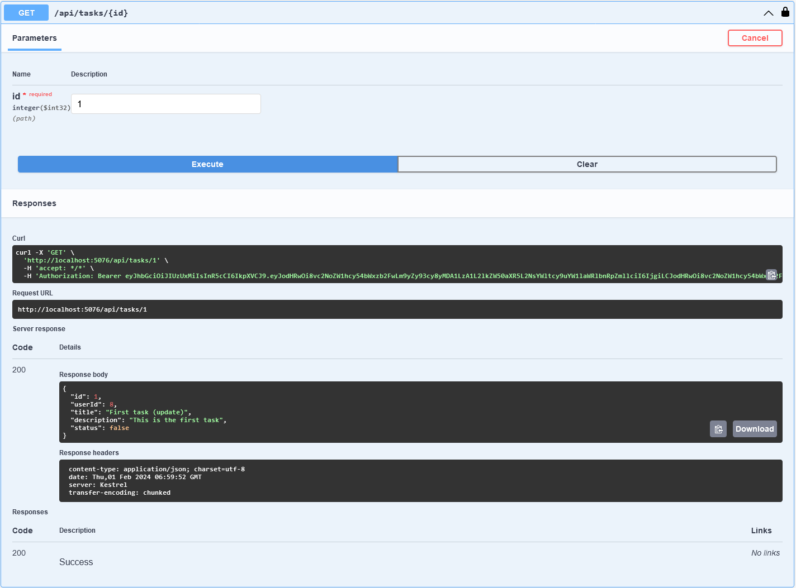

# Task Management Application (ASP\.NET Core)

#### For Running The Project
To run the application, you need to have the following installed on your machine:
+ Dotnet SDK version 7 or higher

Clone the github repo
```
git clone https://github.com/nayef-shuvo/TaskManager.git
```

Run the project
```
cd TaskManager/TaskManager.Server
dotnet run
```
+ The application will be available at https://localhost:5076

+ For swagger support http://localhost:5076/swagger/index.html


## Endpoints

+ #### User Registraion
POST /`api/register`

+ Request
```
{
  "username": "shuvo2",
  "email": "shuvo2@gmail.com",
  "password": "1234Abcd#"
}
```

- Response
```
{
  "message": "User registration has been completed successfully"
}
```


<br/>

+ #### Login
POST /`api/login`

* Request

```
{
  "username": "shuvo2",
  "password": "1234Abcd#"
}
```

* Response

```
{
  "username": "shuvo2",
  "email": "shuvo2@gmail.com",
  "role": 1,
  "bearer": "eyJhbGciOiJIUzUxMiIsInR5cCI6IkpXVCJ9.eyJodHRwOi8vc2NoZW1hcy54bWxzb2FwLm9yZy93cy8yMDA1LzA1L2lkZW50aXR5L2NsYWltcy9uYW1laWRlbnRpZmllciI6IjEzIiwiaHR0cDovL3NjaGVtYXMueG1sc29hcC5vcmcvd3MvMjAwNS8wNS9pZGVudGl0eS9jbGFpbXMvbmFtZSI6InNodXZvMiIsImh0dHA6Ly9zY2hlbWFzLnhtbHNvYXAub3JnL3dzLzIwMDUvMDUvaWRlbnRpdHkvY2xhaW1zL2VtYWlsYWRkcmVzcyI6InNodXZvMkBnbWFpbC5jb20iLCJodHRwOi8vc2NoZW1hcy5taWNyb3NvZnQuY29tL3dzLzIwMDgvMDYvaWRlbnRpdHkvY2xhaW1zL3JvbGUiOiJVc2VyIiwiZXhwIjoxNzA2ODU2NTg3LCJpc3MiOiJodHRwczovL2xvY2FsaG9zdDo3MTU2IiwiYXVkIjoiaHR0cHM6Ly9sb2NhbGhvc3Q6NzE1NiJ9.mJ9utdfn04JVmE2JPHOzhQO3EyPAN027KRIKyH2NsFzSHL8uVAPlyBDSoHx51hD30MdvLvSxVnIyI_ZS-_MLHw"
}
```


* #### Getting All Tasks
GET `/api/tasks`

* Response
```
[
  {
    "id": 1,
    "userId": 8,
    "title": "First task (update)",
    "description": "This is the first task",
    "status": false
  },
  {
    "id": 2,
    "userId": 8,
    "title": "updated title",
    "description": "updated description",
    "status": true
  },
  {
    "id": 3,
    "userId": 8,
    "title": "Task3",
    "description": "Testing Put endpoint",
    "status": false
  },
  {
    "id": 14,
    "userId": 8,
    "title": "New Task",
    "description": "New task description",
    "status": true
  }
]
```


* #### Getting Task by Id

GET `/api/tasks/:id`

* Reponse
```
{
  "id": 1,
  "userId": 8,
  "title": "First task (update)",
  "description": "This is the first task",
  "status": false
}
```


* #### Creating New Task
POST `/api/tasks/`
* Request

```
{
  "title": "Task Title",
  "description": "Task description",
  "status": false
}
```
* Response
```
{
  "id": 15,
  "userId": 8,
  "title": "Task Title",
  "description": "Task description",
  "status": false
}
```


* #### Updating Task by Id
PUT `/api/tasks/:id`

* Request
```
{
  "title": "Updated Task Title",
  "description": "Updated task description",
  "status": true
}
```

* Response
```
{
  "id": 15,
  "userId": 8,
  "title": "Updated Task Title",
  "description": "Updated task description",
  "status": true
}
```


* #### Deleting a Task by Id
DELETE `/api/tasks/:id`

* Response Header
```
204 No Content
```
